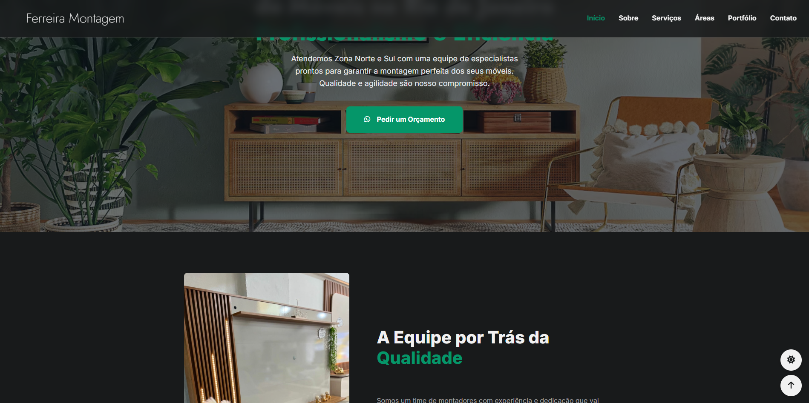

# Projeto Freelancer: Site de Captação de Clientes (MontadorPro RJ)

<p align="center">
  <em>Site institucional One-Page desenvolvido para uma equipe de montadores de móveis, com foco total em SEO local, performance e conversão de clientes.</em>
</p>

<p align="center">
  
  
  
</p>

<br>

<p align="center">
  
</p>

---

### 🔗 Links

- **Ver Projeto Online:** `https://montador-tan.vercel.app/`
- **Repositório:** `https://github.com/GabrielDevelop777/ferreira-montagem`

---

### 📖 Sobre o Projeto

Este é um projeto freelancer real, desenvolvido para uma equipe de montadores de móveis no Rio de Janeiro. O principal objetivo foi criar uma presença online profissional e uma ferramenta eficaz para gerar leads (pedidos de orçamento) através de um site rápido, responsivo e otimizado para os mecanismos de busca (SEO).

O código foi inteiramente refatorado para utilizar classes e IDs em português, mantendo a legibilidade e a facilidade de manutenção.

---

### ✨ Funcionalidades Principais

- [x] **Design Responsivo:** Layout perfeitamente adaptado para desktops, tablets e celulares.
- [x] **SEO Local:** Estrutura e conteúdo otimizados para ser encontrado no Google nas áreas de atuação (Zona Norte e Sul do RJ).
- [x] **Foco em Conversão:** Múltiplos botões de Call-to-Action (CTA) para contato rápido via WhatsApp.
- [x] **Tema Dark & Light:** Com seletor para conforto visual do usuário.
- [x] **Persistência de Tema:** A escolha do tema (claro ou escuro) é salva no navegador do usuário (`localStorage`).
- [x] **Animações Modernas:** Elementos que surgem suavemente na tela com o uso da `Intersection Observer API`.
- [x] **Navegação Inteligente:** Menu com destaque para a seção ativa e botão "Voltar ao Topo".
- [x] **Código Organizado:** CSS com estrutura comentada e classes/IDs em português para fácil entendimento.

---

### 🛠️ Tecnologias Utilizadas

O projeto foi construído do zero, sem o uso de frameworks, para garantir a máxima performance.

- **HTML5** (Semântico)
- **CSS3** (Variáveis, Flexbox, Grid, Media Queries)
- **JavaScript** (ES6+, Vanilla JS, manipulação do DOM, Intersection Observer, LocalStorage)
- **Font Awesome** (Ícones)

---

### 🚀 Como Executar o Projeto Localmente

```bash
# 1. Clone o repositório
git clone https://github.com/GabrielDevelop777/ferreira-montagem

# 2. Acesse a pasta do projeto
cd nome-da-pasta-do-projeto

# 3. Abra o arquivo 'index.html' no seu navegador de preferência.
```
O projeto é totalmente estático e não requer nenhuma dependência ou servidor para ser executado.